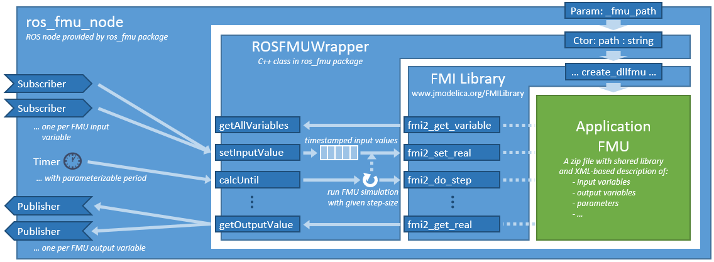
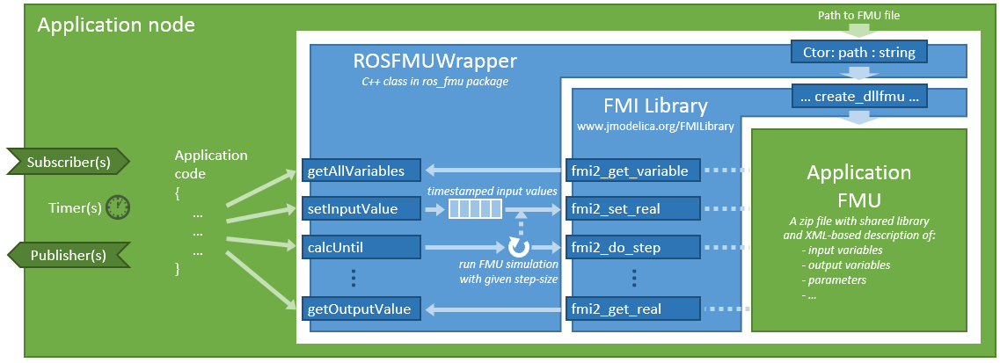

General information about this repository, including legal information, build instructions and known issues/limitations, are given in [README.md](../README.md) in the repository root.


# The ros_fmu package

ros_fmu is a small ROS package for wrapping *functional mockup units (FMUs)* for co-simulation of physical models into ROS nodes. FMUs are defined in the [FMI standard](http://fmi-standard.org/). This package currently only supports co-simulation FMUs according to the FMI 2.0 standard.

FMUs can be created with a variety of modeling and simulation tools. Examples are [Dymola](http://www.3ds.com/products-services/catia/products/dymola), [MATLAB/Simulink](https://www.mathworks.com/products/simulink.html), [OpenModelica](https://www.openmodelica.org/), [SimulationX](https://www.simulationx.de/), and [Wolfram System Modeler](http://www.wolfram.com/system-modeler/).

Technically, a co-simulation FMU is a zip file (with suffix .fmu) containing a physical model and the corresponding solver as a shared library together with an XML file describing the inputs, outputs and parameters of the model and details of the solver configuration. An addition, the zip file may contain the source code of the model and solver in the C programming language.


## ros_fmu node

ros_fmu provides a ROS node ([ros_fmu_node.cpp](src/ros_fmu_node.cpp)), which takes an FMU and creates input and output topics for each input and output variable of the FMU and runs the FMU's solver with a user-defined rate according to the ROS clock. This approach is illustrated in the following diagram.



The ros_fmu_node also searches for counterparts for each FMU parameter and variable in the [ROS parameter server](http://wiki.ros.org/Parameter%20Server) and initializes the FMU correspondingly.

For this purpose, this package provide a launch file with argument _fmu\_path_. Simply call

```
roslaunch ros_fmu ros_fmu_node.launch fmu_path:=[PathToTheFMUFile]
```

Please see the [README.md of the ros_fmu_examples package](../ros_fmu_examples/README.md) for a step-by-step description how to use the ros_fmu node with a damped pendulum model and FMU.


## ros_fmu library

ros_fmu provides a library with convenience functions based on common ROS types to load an FMU during runtime, retrieve the input, output, and parameter names,  set timestamped input values, run the FMU's numeric solver, and query the resulting output. These functions are provided by the class [ROSFMUWrapper](include/ros_fmu/ROSFMUWrapper.h). Instances of this class may be integrated in application-specific ROS nodes or library as illustrated in the following architecture diagram.



For parsing the XML description of an FMU and for running the FMU's solver, ros_fmu uses the C library [FMI Library](http://www.jmodelica.org/FMILibrary). This library is downloaded, compiled and linked in CMakeLists.txt of this package using cmake's _externalproject\_add_ command.


## Running an FMU inside a ROS node or library

In the following, we give some code snippets how to load and run an FMU file from an application-specific ROS node or library.

**Step 1:** Include the ROSFMUWrapper.h from the ros_fmu package in your C++ code.

```
#include "ros_fmu/ROSFMUWrapper.h"
```

**Step 2:** Instantiate the wrapper class with the path to the FMU file and the desired simulation step size.

```
ros::Duration fmuStepSize(0.001);
ros_fmu::ROSFMUWrapper wrapper(fmuPath, fmuStepSize);
```

**Step 3:** Create subscribers or timers to set the FMU's input values. For example:

```
ros::Subscriber subscriber =
    nHandle.subscribe<std_msgs::Float64>("angle_x", 1000, [&wrapper](const std_msgs::Float64::ConstPtr& msg) {
      wrapper.setInputValue("angleX", ros::Time::now(), msg->data);
    });
```

Here, `angle_x` is the topic name whereas `angleX` is the corresponding input variable of the FMU.

Use `wrapper.getInputVariableNames()` to get a list of all input variables.

**Step 4:** Create a timer or subscriber that triggers the simulation of the FMU using `wrapper.calcUntil(..)`. For example:

```
ros::Timer timer = nHandle.createTimer(ros::Duration(0.01), [&](const ros::TimerEvent& event) {
    wrapper.calcUntil(event.current_expected);
    double y = wrapper.getOutputValue("angleY");
    // ... e.g., publish y on a topic ...
  });
```

Use `wrapper.getOutputVariableNames()` to get a list of all output variables.

**Step 5:** Sets parameters and initial values of the FMU:

```
wrapper.setInitialValue("dampingParam", 0.21);
wrapper.setInitialValue("angleX", 1.3);
```

The function `wrapper.initializeFromROSParameters(nHandle)` may be used to initialize all parameters from the corresponding ROS parameters. Please note that all characters in the FMU parameter names that are not supported by ROS are replaced by an '\_', cf. `ROSFMUWrapper::rosifyName(name)`.

**Step 6:** Just before starting the spin thread, exit the FMU's initialization mode and set the ROS time that refers to the FMU's internal timepoint 0.0.

```
wrapper.exitInitializationMode(ros::Time::now());
ros::spin();
```
